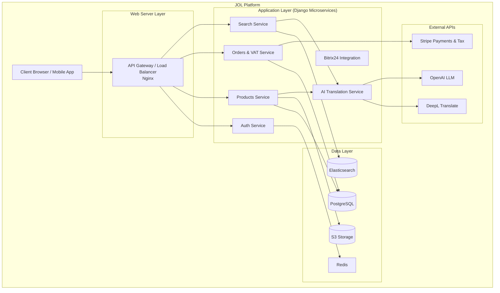

---

# **Journey Of Life (JOL): The European Ecclesiastical Marketplace**

[](https://www.djangoproject.com/)
[](https://www.python.org/)
[](LICENSE)
[](https://github.com/psf/black)
[](https://github.com/your-organization/marketplace-jol)

### **Connecting Faith Communities with Trusted Sellers Across Europe**

**JOL** is the premier digital marketplace dedicated to serving the unique needs of churches, parishes, and bereavement services across all 27 EU nations and beyond. We simplify the process of sourcing sacred utensils, vestments, icons, and services, all within a platform built on trust, tradition, and technology.

**🌍 Browse and transact in your native language,** including Ukrainian, Russian, Arabic, and all official EU languages.

---

## **Who Is JOL For?**

Whether you are part of a large diocese or a small parish, JOL is designed for you.

| **For Buyers...**                                          | **For Sellers...**                                          |
| :--------------------------------------------------------- | :---------------------------------------------------------- |
| **✅ Catholic & Orthodox Parishes:** Find everything from chalices and censers to icons and vestments from verified, traditional suppliers. | **✅ Artisans & Manufacturers:** Showcase your high-quality, traditionally crafted goods to a dedicated, entire European audience. |
| **✅ Protestant Churches:** Source communion sets, theological literature, and audio-visual equipment. | **✅ Distributors & Retailers:** Manage your inventory and reach churches directly, eliminating unnecessary intermediaries. |
| **✅ Funeral Homes & Cemeteries:** Advertise bereavement services, source memorials, and connect with families in their time of need. | **✅ Service Providers:** List your grave cleaning, monument restoration, or funeral catering services to a targeted, local audience. |
| **✅ Diocese & Institutional Administrators:** Manage procurement for multiple churches with consolidated billing and reporting. | **✅ Publishers & Theological Schools:** Offer books, courses, and educational materials to a engaged faith community. |

---

## **Why Choose JOL? Your Challenges, Solved.**

| Your Need                                                  | The JOL Solution                                                                                                                              |
| :--------------------------------------------------------- | :-------------------------------------------------------------------------------------------------------------------------------------------- |
| **Finding Specialized Items**                              | **A Dedicated Niche Marketplace:** No more sifting through generic e-commerce sites. Every product and service is relevant to your mission.   |
| **Trusted, Vetted Sellers**                                | **A Community of Faith:** We prioritize and verify sellers who understand the sacred nature of the items they provide.                        |
| **Navigating EU VAT & Languages**                          | **Built-In Compliance & Translation:** We automatically handle complex EU VAT calculations and provide seamless translation for all listings. |
| **Leaving a Legacy**                                       | **A Lasting Memorial:** Funeral homes and monument services can create a permanent, respectful presence for families seeking their services.  |
| **Reaching Your Entire Congregation**                      | **Multi-Language from the Start:** Create a listing once, and it is instantly accessible to potential buyers across Europe in their own language. |

---

## **For Technical Professionals & Contributors**

JOL is a robust, open-source platform built with modern, scalable technology to ensure reliability and performance for thousands of communities.

### **High-Level Architecture**



### **Technology Stack**

*   **Backend Framework:** Django & Django REST Framework (DRF)
*   **Database:** PostgreSQL with PostGIS
*   **Search:** Elasticsearch
*   **Cache & Tasks:** Redis, Celery
*   **Payment & VAT:** Stripe with Stripe Tax
*   **Translation:** DeepL API + Custom LLM Integration
*   **Containerization:** Docker, Kubernetes
*   **Frontend:** React (Next.js)

---

## **Getting Started**

### **For Churches & Sellers (Using the Platform)**

The JOL platform is currently in active development. **We are inviting pioneering churches and sellers in Lithuania for our initial launch.**

*   **Are you a seller interested in early access?** Please contact us at journey4oflife+4sellers@gmail.comu to discuss verification and listing.
*   **Are you a church or diocese administrator?** Email journey4oflife+4churches@gmail.com to be notified upon launch and to provide your specific needs.

### **For Developers (Contributing to the Platform)**

We welcome skilled developers who share our mission to contribute to this open-source project.

1.  **Clone the repo:**
    ```bash
    git clone https://github.com/JourneyOfLife/marketplace-jol.git
    cd marketplace-jol
    ```

2.  **Review our detailed [Contributing Guide](CONTRIBUTING.md)** and [Code of Conduct](CODE_OF_CONDUCT.md).

3.  **Setup with Docker (recommended):**
    ```bash
    cp .env.example .env  # Configure your environment variables
    docker-compose up -d  # Start all services (Django, DB, Redis, Search)
    docker-compose exec web python manage.py migrate  # Setup the database
    ```

---

## **License, Support, and Security**

*   **📜 License:** This project is licensed under the GNU Affero General Public License v3.0 - see the [LICENSE](LICENSE) file for details.
*   **🔒 Security:** Please report any security vulnerabilities privately via our [Security Policy](SECURITY.md).
*   **🙋 Support:** For general questions and support, please open a [GitHub Discussion](https://github.com/JourneyOfLife/marketplace-jol/discussions).

---

**A Mission-Driven Platform. A Community Built on Trust.**
**Journey Of Life – Serving the Servants.**
